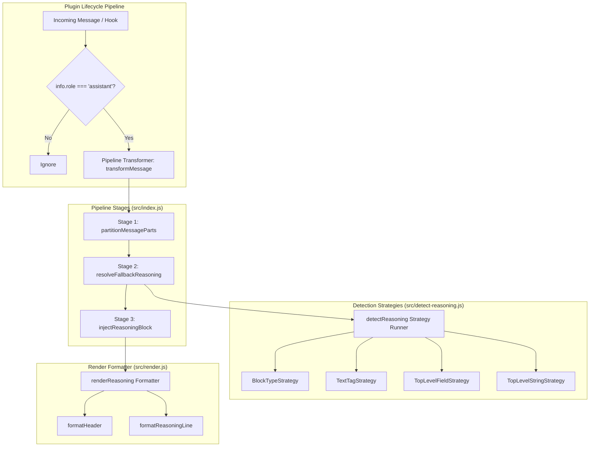

# Meticulous Execution Plan: Refactoring with Clean Code, Design Patterns, and Software Engineering Standards

## 1. Overview & Objectives
Elevate code quality, modularity, readability, and maintainability across the `think-separator-plugin` codebase by applying production-grade software engineering principles (**SOLID**, **KISS**, **DRY**, **YAGNI**, **POLA**, and **Clean Code**) without modifying any business logic, runtime behavior, or public API contracts.

---

## 2. Framework of Applied Principles & Patterns

### A. Core Software Engineering Principles
| Principle | Concrete Application in Codebase |
|---|---|
| **Single Responsibility (SRP)** | Every function performs exactly one task: partitioning, detecting, sanitizing, formatting, or assembling. Monolithic functions are decomposed into focused units. |
| **Open/Closed (OCP)** | Reasoning detection strategies are decoupled into modular functions. New providers or fields can be added to the strategy registry without modifying core parsing loops. |
| **Don't Repeat Yourself (DRY)** | Shared formatting and extraction helpers; XML tag processing logic unified into reusable pure utility functions. |
| **You Aren't Gonna Need It (YAGNI)** | Elimination of obsolete ANSI escape constants (`DIM`, `RESET`, `BOLD`, `UNDERLINE`) in `render.js`. Zero external dependencies or unnecessary abstractions. |
| **Keep It Simple, Stupid (KISS)** | Clean, direct architecture built on pure vanilla JavaScript ESM functions without heavy class instantiation or opaque metaprogramming. |
| **Principle of Least Astonishment (POLA)** | Deterministic behavior, predictable and controlled state mutations on `msg.parts`, and self-documenting naming conventions throughout. |

---

### B. Architectural Design Patterns



---

## 3. Detailed Component Specifications

### 1. `src/config.js` — Configuration Factory & DTO
* **Responsibility:** Defensive validation, normalization, and immutable freezing of plugin options.
* **Refactorings:**
  * Define `@typedef {Object} PluginConfig` and `@typedef {Object} UserConfig` with comprehensive JSDoc.
  * Early return guard clauses for input sanitization.
  * Immutable frozen return values via `Object.freeze`.
* **Public Contract:**
  ```javascript
  /**
   * @typedef {Object} PluginConfig
   * @property {string} label
   */
  export const defaultConfig = Object.freeze({ label: 'Reasoning' });
  export function mergeConfig(userConfig);
  ```

---

### 2. `src/render.js` — Formatter & Template Pattern
* **Responsibility:** Markdown formatting and assembly of reasoning blocks and responses.
* **Refactorings:**
  * **Dead Code Elimination (YAGNI):** Remove unused ANSI escape constants (`DIM`, `RESET`, `BOLD`, `UNDERLINE`).
  * **Functional Decomposition (SRP):**
    * `formatHeader(label)`: Returns `> ### ── ${label} ──`.
    * `formatReasoningLine(line)`: Formats individual lines as quoted italics (`> *${line}*`) or empty quotes (`>`).
    * `renderReasoning(reasoningText, label)`: Composes header, formatted body, and trailing double newline separator.
    * `renderResponse(responseText)`: Indents response text with 2 leading spaces.
    * `compose(detection, responseText, label)`: Coordinates reasoning and response blocks.
* **Public Contract:** 100% preserved (`renderReasoning`, `renderResponse`, `compose`).

---

### 3. `src/detect-reasoning.js` — Strategy Pattern & Extraction Engine
* **Responsibility:** Multi-provider reasoning detection and robust XML reasoning tag extraction.
* **Refactorings:**
  * **Decoupled Detection Strategies (Strategy Pattern / Chain of Responsibility):**
    1. `detectInContentBlocks(message)`: Scans `content[]` blocks where `type` matches `REASONING_SET`.
    2. `detectInContentTextTags(message)`: Scans `content[]` text blocks for XML reasoning tags.
    3. `detectInTopLevelFields(message)`: Scans top-level fields matching `REASONING_FIELDS`.
    4. `detectInStringContent(message)`: Scans `message.content` when given as a raw string with XML reasoning tags.
  * **XML Extraction Pipeline (`extractReasoningFromText`):**
    * Decomposed into linear sub-phases: closed tag extraction, trailing unclosed tag extraction, and orphan tag sanitization.
* **Public Contract:** 100% preserved (`REASONING_FIELDS`, `REASONING_TAG_NAMES`, `extractReasoningFromText`, `detectReasoning`).

---

### 4. `src/index.js` — Pipeline Transformer Pattern & Plugin Lifecycle
* **Responsibility:** Orchestrate OpenCode server hook and transform in-memory message parts.
* **Refactorings:**
  * **Pipeline Transformer:** Decompose `transformMessage(msg, label)` into 3 pure, modular stages:
    1. `partitionMessageParts(parts)`: Classifies parts into extracted reasoning texts and sanitized non-reasoning parts.
    2. `resolveFallbackReasoning(cleanParts, msg, existingReasoningCount)`: Executes defense-in-depth detection fallback only when no explicit reasoning parts were found.
    3. `injectReasoningBlock(cleanParts, reasoningTexts, label)`: Formats reasoning block and prepends it to the first text part or creates a leading text part.
  * **Guard Clauses:** Defensive structure validation (`!msg || !Array.isArray(msg.parts)`).
* **Public Contract:** 100% preserved (`ThinkSeparator`, `transformMessage`, `default`).

---

## 4. Verification & Quality Assurance Matrix

### A. Automated Unit Tests
Run the entire test suite to guarantee 100% behavioral parity:
```bash
node --test test/*.test.js
```
* `test/config.test.js` (4 tests) — Default config, merge, overrides, forward-compatibility.
* `test/detect-reasoning.test.js` (11 tests) — Providers (Anthropic, OpenAI, Google, MiniMax, Control), XML tags, edge cases.
* `test/render.test.js` (4 tests) — Header formatting, custom labels, response indentation, compose helper.
* `test/plugin.test.js` (8 tests) — Full message transformation, tool call preservation, unclosed tags.

### B. Code Formatting & Style Compliance
Run Prettier to enforce codebase style standards:
```bash
npm run prettier:fix
```

---

## 5. Risk Assessment & Mitigation

| Risk | Impact | Mitigation Strategy |
|---|---|---|
| Regex extraction drift | None | All regex constants and frozen arrays transferred verbatim without pattern alteration. |
| Breaking downstream plugin imports | None | All named and default exports preserved identically. |
| Hot path performance regression | None | Pure synchronous $\mathcal{O}(N)$ in-memory operations with precompiled regex patterns and zero I/O. |
