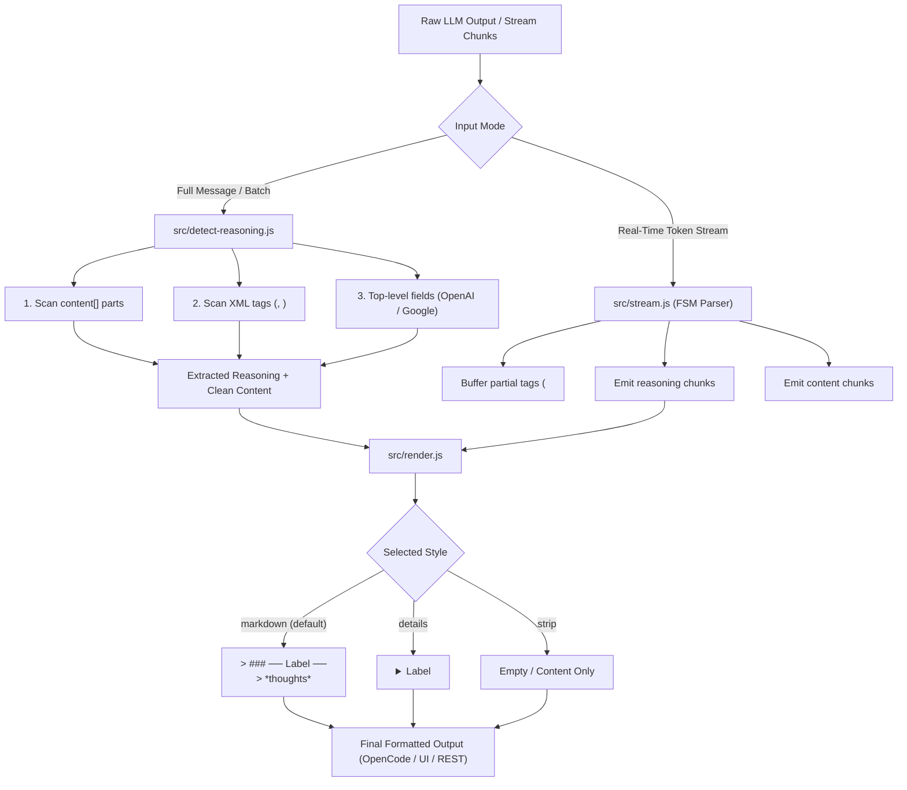

# Architectural Standards, Deep Research & Refined Execution Plan

## 1. Core Engineering Principles & Architectural Standards

To ensure the highest quality, maintainability, and scalability, all new modules, refactors, and interfaces will strictly adhere to foundational software engineering principles, design patterns, and clean code standards:

```
┌─────────────────────────────────────────────────────────────────────────────┐
│                       FOUNDATIONAL PRINCIPLES APPLIED                       │
│                                                                             │
│  [KISS]  Simple, readable pure functions over complex class hierarchies.    │
│  [YAGNI] Only solve reasoning separation & streaming; no bloated AST trees. │
│  [DRY]   Single source of truth for tag names & reasoning fields.           │
│  [SOLID] Single Responsibility Modules + Open/Closed Provider Whitelists.  │
│  [CLEAN] Descriptive naming, small functions (<30 lines), clear JSDocs.    │
│  [DEF]   Immutability (Object.freeze), safe defaults, zero runtime deps.    │
└─────────────────────────────────────────────────────────────────────────────┘
```

### Applied Principles:
1. **KISS (Keep It Simple, Stupid)**:
   - Prefer simple pure functions, array transforms, and lightweight state machines over complex class hierarchies or monolithic abstractions.
   - Zero runtime dependencies (`dependencies: {}`) to keep package weight near zero and startup instantaneous.
2. **YAGNI (You Aren't Gonna Need It)**:
   - Implement exactly what is required: reasoning tag detection, streaming chunk FSM, modular exports, and configurable renderers.
   - Avoid speculative complexity like generic XML schema validators, AST tree compilers, or heavy parser generators.
3. **DRY (Don't Repeat Yourself)**:
   - Declarative whitelist arrays (`REASONING_TAG_NAMES`, `REASONING_FIELDS`) serve as the single source of truth across static detection, fallback strategies, and streaming parsers.
   - Shared config merging logic (`mergeConfig`) reused uniformly across OpenCode and standalone consumers.
4. **SOLID & Clean Architecture**:
   - **Single Responsibility (SRP)**:
     - `src/detect-reasoning.js`: Pure detection & extraction logic only.
     - `src/render.js`: Pure string rendering & formatting only.
     - `src/stream.js`: Real-time streaming state machine only.
     - `src/config.js`: Configuration validation & defaults only.
     - `src/index.js`: OpenCode hook adapter only.
     - `src/core.js`: Agnostic public API gateway.
   - **Open/Closed (OCP)**: Adding new providers or tag types is done by extending declarative lists, without rewriting core parsing logic.
5. **Design Patterns Used**:
   - **Strategy Pattern**: Used in `detectReasoning` to evaluate detection strategies in priority order.
   - **Adapter Pattern**: Used in `src/index.js` to adapt the pure core logic to OpenCode's `experimental.chat.messages.transform` hook.
   - **Finite State Machine (FSM)**: Used in `src/stream.js` to handle token stream transitions reliably across chunk boundaries.
   - **Factory / Builder Pattern**: `createReasoningStreamParser()` creates independent, isolated stream parser instances.
6. **Defensive Programming & Immutability**:
   - `Object.freeze()` on all default configurations and whitelist constants.
   - Pure functions that return new data copies rather than mutating arguments unexpectedly (except inside the OpenCode hook where in-place mutation is explicitly required by framework specification).

---

## 2. Architecture Overview & Component Diagram

```
┌─────────────────────────────────────────────────────────────────────────────┐
│                            ARCHITECTURE OVERVIEW                            │
│                                                                             │
│   opencode-think-separator-plugin (Root entry - src/index.js)               │
│   ├── OpenCode Plugin Hook Adapter (experimental.chat.messages.transform)  │
│   │                                                                         │
│   ├── Subpath: ./core (src/core.js)                                         │
│   │   ├── extractReasoningFromText()  [XML tags: <think>, <thought>, etc.]  │
│   │   ├── detectReasoning()           [Top-level & content[] fields]        │
│   │   └── mergeConfig()               [Configuration resolver]              │
│   │                                                                         │
│   ├── Subpath: ./stream (src/stream.js)                                     │
│   │   └── createReasoningStreamParser() [FSM for token-by-token streams]    │
│   │                                                                         │
│   ├── Subpath: ./render (src/render.js)                                     │
│   │   ├── renderMarkdownQuote()       [> ### ── Label ── \n > *...*]        │
│   │   ├── renderHtmlDetails()         [<details><summary>Label</summary>]   │
│   │   └── renderStrip()               [Hides/removes reasoning block]       │
│   │                                                                         │
│   └── Types & Tooling (types/*.d.ts, tsconfig.json, Biome)                  │
└─────────────────────────────────────────────────────────────────────────────┘
```

### Data Flow Diagram (Streaming & Static Processing):



---

## 3. Deep Research Findings

### Finding 1: OpenCode Plugin Contract & Runtime Execution
* **Hook Lifecycle**: OpenCode invokes `experimental.chat.messages.transform` right before messages are persisted and sent to the renderer. The hook receives `(input, output)` where `output.messages` must be **mutated in place**.
* **Zero Runtime Dependencies Policy**: OpenCode loads plugins directly via dynamic import from `~/.cache/opencode/node_modules/` or symlinks. Adding heavy transpilers or runtime dependencies slows startup and risks version collisions.
* **Safety Contract**: Retaining pure ESM JavaScript (`"type": "module"`) with JSDoc + generated `.d.ts` types provides TypeScript validation without breaking runtime execution.

### Finding 2: Streaming Reasoner Token Chunking Edge Cases
* **The Split-Token Problem**: In real-time streaming (SSE / WebSockets from DeepSeek-R1, Qwen, Ollama, OpenAI o-series, Anthropic), reasoning tags frequently get split across token boundaries (e.g. chunk 1: `"<th"`, chunk 2: `"ink>\nStep 1..."`).
* **Solution**: A zero-dependency, lightweight **Finite State Machine (FSM)** parser (`createReasoningStreamParser()`) that maintains a small buffer (up to the longest tag name length, ~20 chars) across chunks.

### Finding 3: Universal Package Subpath Exports (`package.json`)
* Modern Node.js (`>=18`), Vite, Webpack, esbuild, and TypeScript (`NodeNext` / `Bundler` resolution) support the `"exports"` map.
* Modular subpaths (`"."`, `"./core"`, `"./stream"`, `"./render"`) allow external frameworks to consume only what they need without loading OpenCode hook wrappers.

---

## 4. Refined Step-by-Step Implementation Plan

### Phase 1: Type Safety & Code Quality Tooling (SOLID / Clean Code)
* **[NEW] [`tsconfig.json`](file:///home/franklin/Desktop/REPO/klassapp/think-separator-plugin/tsconfig.json)**:
  - `target: "ES2022"`, `module: "NodeNext"`, `moduleResolution: "NodeNext"`.
  - `checkJs: true`, `noEmit: true`, `declaration: true`, `declarationDir: "./types"`.
* **[NEW] [`types/index.d.ts`](file:///home/franklin/Desktop/REPO/klassapp/think-separator-plugin/types/index.d.ts)**:
  - Explicit definitions for `MessagePart`, `OpenCodeMessage`, `PluginConfig`, `UserConfig`, `RenderStyle`, `DetectionResult`, `ExtractedReasoning`, `StreamChunkResult`, `ReasoningStreamParser`.
* **[MODIFY] [`package.json`](file:///home/franklin/Desktop/REPO/klassapp/think-separator-plugin/package.json)**:
  - Add `"check:types": "tsc --noEmit"`.
  - Add `"types": "./types/index.d.ts"`.
  - Replace `lint` placeholder with `"lint": "npx @biomejs/biome check src test"`.
  - Add `@biomejs/biome` and `typescript` to `devDependencies`.

---

### Phase 2: Modular Core & Subpath Exports (SRP / Adapter Pattern)
* **[NEW] [`src/core.js`](file:///home/franklin/Desktop/REPO/klassapp/think-separator-plugin/src/core.js)**:
  - Exposes pure standalone functions decoupled from OpenCode hooks (`detectReasoning`, `extractReasoningFromText`, `renderReasoning`, `createReasoningStreamParser`, `mergeConfig`).
* **[MODIFY] [`package.json`](file:///home/franklin/Desktop/REPO/klassapp/think-separator-plugin/package.json)**:
  - Add subpath mappings: `"."`, `"./core"`, `"./stream"`, `"./render"`.

---

### Phase 3: Configurable Render Styles (OCP / DRY)
* **[MODIFY] [`src/config.js`](file:///home/franklin/Desktop/REPO/klassapp/think-separator-plugin/src/config.js)**:
  - Add `style` property (`"markdown"` (default), `"details"`, `"strip"`, `"raw"`).
  - Frozen defaults, safe merge without mutation.
* **[MODIFY] [`src/render.js`](file:///home/franklin/Desktop/REPO/klassapp/think-separator-plugin/src/render.js)**:
  - `renderMarkdownQuote(reasoningText, label)`: Standard markdown blockquote.
  - `renderHtmlDetails(reasoningText, label)`: Collapsible HTML `<details>`.
  - `renderStrip()`: Returns empty string (removes reasoning).
  - `renderReasoning(reasoningText, optionsOrLabel)`: Polymorphic dispatcher supporting both old string labels and new options objects.

---

### Phase 4: Streaming Chunk Parser FSM (FSM / Factory Pattern)
* **[NEW] [`src/stream.js`](file:///home/franklin/Desktop/REPO/klassapp/think-separator-plugin/src/stream.js)**:
  - Factory: `createReasoningStreamParser(options = {})`.
  - Lightweight 4-state machine: `STATE_CONTENT`, `STATE_MAYBE_TAG`, `STATE_REASONING`, `STATE_MAYBE_CLOSE_TAG`.
  - Methods: `feed(chunk: string)`, `flush()`, `getState()`.
* **[NEW] [`test/stream.test.js`](file:///home/franklin/Desktop/REPO/klassapp/think-separator-plugin/test/stream.test.js)**:
  - 10+ test scenarios covering split tokens, unclosed streams, mixed chunks, and zero-reasoning passthrough.

---

### Phase 5: Documentation & Multi-Platform Guides
* **[MODIFY] [`README.md`](file:///home/franklin/Desktop/REPO/klassapp/think-separator-plugin/README.md)**: Updated with multi-platform instructions and configuration options.
* **[NEW] [`docs/STANDALONE_USAGE.md`](file:///home/franklin/Desktop/REPO/klassapp/think-separator-plugin/docs/STANDALONE_USAGE.md)**: Full guides for Node.js backend, React/Next.js frontend, Streaming SSE, and TypeScript.

---

## 5. Usage Guides & Examples

### Example 1: OpenCode TUI Setup (`~/.config/opencode/opencode.json`)
```json
{
  "plugin": [
    [
      "opencode-think-separator-plugin",
      {
        "label": "Deep Thinking",
        "style": "details"
      }
    ]
  ]
}
```

### Example 2: Standalone Node.js Backend / REST API
```javascript
import { extractReasoningFromText, renderReasoning } from "opencode-think-separator-plugin/core";

const rawLLMOutput = "<think>Analyzing user query...</think>Here is the response.";
const { reasoningTexts, cleanText } = extractReasoningFromText(rawLLMOutput);

const formatted = reasoningTexts
  .map(text => renderReasoning(text, { label: "Thinking", style: "markdown" }))
  .join("\n") + cleanText;

console.log(formatted);
```

### Example 3: Real-Time Streaming (SSE / Tokens / Vercel AI SDK)
```javascript
import { createReasoningStreamParser } from "opencode-think-separator-plugin/stream";

const parser = createReasoningStreamParser();

for await (const chunk of tokenStream) {
  const events = parser.feed(chunk);
  for (const event of events) {
    if (event.type === "reasoning") {
      res.write(`data: ${JSON.stringify({ reasoning: event.text })}\n\n`);
    } else {
      res.write(`data: ${JSON.stringify({ content: event.text })}\n\n`);
    }
  }
}

const finalEvents = parser.flush();
for (const event of finalEvents) {
  res.write(`data: ${JSON.stringify({ [event.type]: event.text })}\n\n`);
}
```

### Example 4: Frontend React / Next.js Component
```tsx
import React, { useMemo } from "react";
import ReactMarkdown from "react-markdown";
import { extractReasoningFromText } from "opencode-think-separator-plugin/core";

export const ChatMessage: React.FC<{ rawMessage: string }> = ({ rawMessage }) => {
  const { reasoningTexts, cleanText } = useMemo(() => extractReasoningFromText(rawMessage), [rawMessage]);

  return (
    <div className="chat-bubble space-y-3">
      {reasoningTexts.map((thought, idx) => (
        <details key={idx} className="bg-neutral-900 border border-neutral-800 rounded p-3 text-sm">
          <summary className="cursor-pointer text-neutral-400 font-medium select-none">
            💭 Reasoning ({thought.split("\n").length} steps)
          </summary>
          <div className="mt-2 text-neutral-300 italic whitespace-pre-wrap pl-2 border-l-2 border-neutral-700">
            {thought}
          </div>
        </details>
      ))}
      <div className="prose dark:prose-invert">
        <ReactMarkdown>{cleanText}</ReactMarkdown>
      </div>
    </div>
  );
};
```

---

## 6. Verification Plan

### Automated Verification
1. **Existing Test Suite**: `npm test` (all 27 tests pass unchanged).
2. **New Tests**: `test/stream.test.js`, `test/render.test.js`, `test/core.test.js`.
3. **Type Checking**: `npx tsc --noEmit` (0 errors).
4. **Linting & Code Style**: `npm run lint` and `npm run format:check`.

### Manual & Smoke Verification
- Verify OpenCode plugin import: `node -e "import('./src/index.js').then(m => console.log('Plugin OK:', typeof m.default.server))"`
- Verify core subpath: `node -e "import('./src/core.js').then(m => console.log('Core OK:', typeof m.extractReasoningFromText))"`
