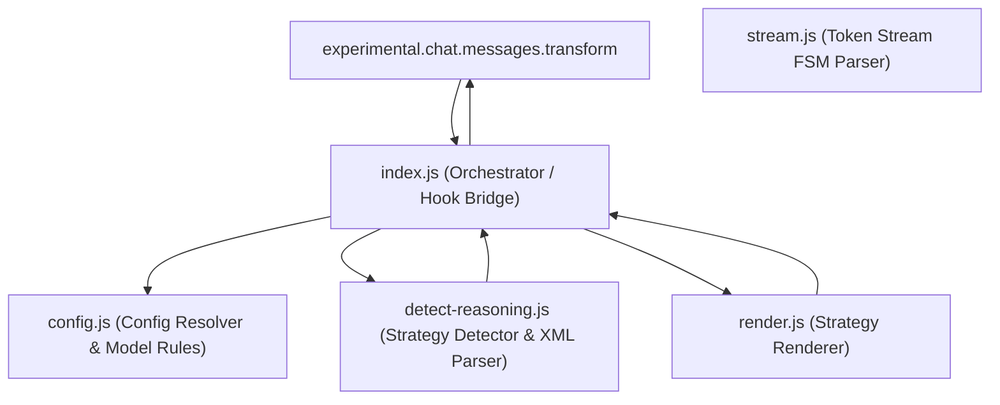
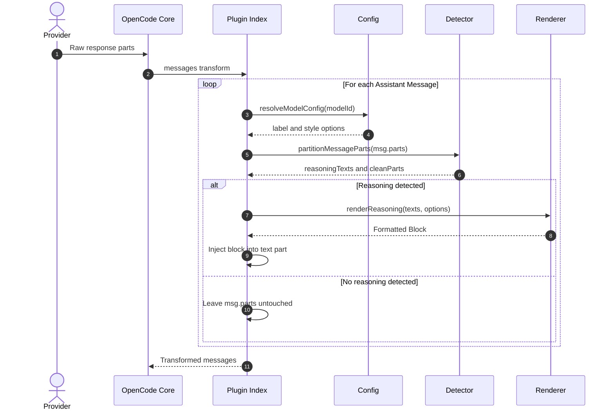

# Implementation Plan — Enhancements for opencode-think-separator-plugin (v0.3.0+)

This plan outlines high-value enhancements to `opencode-think-separator-plugin` without migrating to TypeScript, preserving its zero-build, zero-runtime-dependencies, and high-performance ESM architecture while adhering to Clean Code, SOLID, DRY, KISS, and YAGNI principles.

---

## Architecture & Data Flow Diagrams

### 1. High-Level Component Architecture (Clean Architecture & Strategy Patterns)



---

### 2. Message Transformation Pipeline (Detailed Sequence Flow)



---

## Architectural Principles & Constraints

- **No TypeScript Migration (Zero-Build)**: Plain modern ESM (`.js`), strict JSDoc annotations, validated via `tsc --noEmit` (`checkJs: true`) and [types/index.d.ts](file:///home/franklin/Desktop/REPO/klassapp/think-separator-plugin/types/index.d.ts).
- **Zero Runtime Dependencies**: No external packages in `dependencies`. Native Node.js built-ins only.
- **KISS & YAGNI**: Focus strictly on features that solve real user problems in OpenCode TUI; avoid speculative complexity.
- **Open/Closed Principle (OCP)**: Strategy patterns for renderers and detectors allow adding new styles or models without modifying existing pipeline logic.
- **Backward Compatibility**: Any config or public API from `v0.2.0` must continue working without breaking existing users.

---

## User Review Required

> [!NOTE]
> No breaking changes to default behavior. The plugin will continue to render Markdown blockquotes by default. New styles, per-model configuration, and metadata badges will be purely opt-in via `opencode.json`.

---

## Proposed Changes

### Component 1: Config & Model-Specific Routing (KISS + OCP)

Enable users to customize the rendering style or label per model, as well as customize recognized XML tags.

#### [MODIFY] [src/config.js](file:///home/franklin/Desktop/REPO/klassapp/think-separator-plugin/src/config.js)
- Enhance `mergeConfig` to support:
  - `models`: an optional map of `{ [modelPattern: string]: { style?: RenderStyle, label?: string } }`.
  - `customTags`: an optional array of extra XML tags to detect (e.g. `["thought_process", "reflection"]`).
- Implement safe pattern matching (exact match or prefix wildcard, e.g. `"deepseek/*"`).
- Maintain frozen defaults and immutability (DRY / pure function).

#### [MODIFY] [types/index.d.ts](file:///home/franklin/Desktop/REPO/klassapp/think-separator-plugin/types/index.d.ts)
- Update `UserConfig` and `PluginConfig` types to reflect model overrides and custom tag options.

---

### Component 2: Tag & Provider Heuristics Expansion (DRY)

#### [MODIFY] [src/detect-reasoning.js](file:///home/franklin/Desktop/REPO/klassapp/think-separator-plugin/src/detect-reasoning.js)
- Extend default `REASONING_TAG_NAMES` with emerging models: `reflection`, `internal_thought`.
- Make tag compilation dynamic if custom tags are provided in config, reusing the cached RegExp when defaults are unchanged (performance & DRY).
- Support duration/token metadata extraction if present in top-level fields (e.g. `thinking_duration_ms` or `thinking_budget`).

---

### Component 3: Renderers & Metadata Badges (Single Responsibility)

#### [MODIFY] [src/render.js](file:///home/franklin/Desktop/REPO/klassapp/think-separator-plugin/src/render.js)
- Add optional metadata badge in header formatting:
  - When duration or token count is known, format header cleanly:
    `> ### ── Reasoning (~1.2s) ──` or `> ### ── Reasoning (450 tokens) ──`.
- Keep render functions pure and decoupled from model detection logic.
- Add `ansi` or `minimal` render style if requested, adhering to the `RENDER_STYLES` strategy map.

---

### Component 4: Pipeline Integration in `transformMessage`

#### [MODIFY] [src/index.js](file:///home/franklin/Desktop/REPO/klassapp/think-separator-plugin/src/index.js)
- In `ThinkSeparator`, resolve active model configuration from message info (`msg.info?.model` or session metadata).
- Forward resolved `{label, style}` down to `transformMessage` so model-specific overrides apply seamlessly.

---

### Component 5: Automated Testing & CI/CD Automation

#### [NEW] [test/model-config.test.js](file:///home/franklin/Desktop/REPO/klassapp/think-separator-plugin/test/model-config.test.js)
- Unit tests verifying per-model configuration overrides, fallback to defaults, and custom tag detection.

#### [NEW] [.github/workflows/publish.yml](file:///home/franklin/Desktop/REPO/klassapp/think-separator-plugin/.github/workflows/publish.yml)
- GitHub Actions workflow for automated npm release with Provenance when creating git tags (`v*.*.*`), eliminating manual terminal token handling.

---

## Verification Plan

### Automated Tests
- `npm run check:fix`
  - Runs Prettier, Biome, TypeScript type check (`tsc --noEmit`), and Node.js native test runner (`node --test test/*.test.js`).
- Verify existing 59 tests still pass (100% regression-free).
- Verify new tests for model-based config and custom tags pass.

### Manual Verification
- Test in local OpenCode instance via `./bin/dev.sh` with a sample `opencode.json` containing:
  ```json
  {
    "plugin": ["opencode-think-separator-plugin"],
    "label": "Thinking Process",
    "style": "details"
  }
  ```
- Verify `<details>` rendering and custom label appearance.
