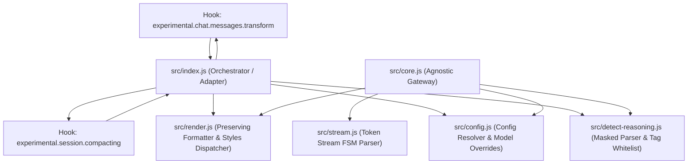
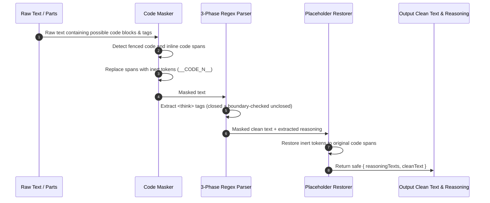
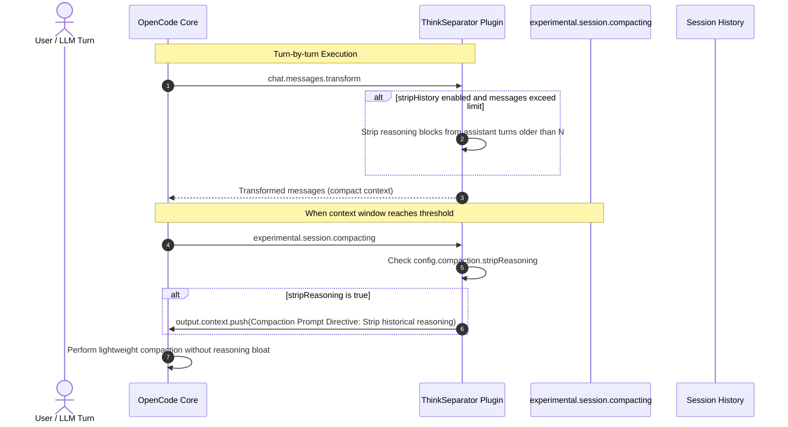

# Implementation Plan — Think Separator Plugin v4 (v0.4.0)

> **For agentic workers:** REQUIRED SUB-SKILL: Use superpowers:subagent-driven-development (recommended) or superpowers:executing-plans to implement this plan task-by-task. Steps use checkbox (`- [ ]`) syntax for tracking.

**Goal:** Elevate `opencode-think-separator-plugin` to v4 (v0.4.0) by resolving critical edge cases (code block false positives, code fence destruction inside reasoning, duplicate headers), adding TUI length management (`maxLines`, `compact`, `quote` styles), context window protection during OpenCode session compaction, real provider fixtures, and complete type safety.

**Architecture:** Maintain strict zero-runtime-dependencies, zero-build plain ESM architecture (`Node.js >= 18`), Strategy and Adapter patterns. Parser isolation through tokenized code masking, AST-safe blockquote rendering, multi-turn history pruning for context savings, and backward-compatible configuration expansion.

**Tech Stack:** Node.js built-ins (`node:test`, `node:assert/strict`), ECMAScript Modules (ESM), TypeScript definitions (`tsc --noEmit`), Biome, Prettier.

---

## Global Constraints

- **Zero Runtime Dependencies**: No external packages in `dependencies`. Native Node.js built-ins only.
- **No TypeScript Build Step**: Source remains plain `.js` ESM with strict JSDoc annotations; validated via `types/index.d.ts` and `tsc --noEmit`.
- **100% Backward Compatibility**: All v0.2.0 and v0.3.0 configuration options (`label`, `style`, `models`, `customTags`) and public API signatures must continue working without breaking changes.
- **Quality Gates**: All 121 existing tests must pass, plus all new test suites. Biome linting and Prettier formatting must pass cleanly with `npm run check:fix`.

---

## Architecture & Data Flow Diagrams

### 1. High-Level Component Architecture (v4)



---

### 2. Robust Detection & Code-Masking Sequence Flow



---

### 3. Session Compaction & Context Protection Sequence Flow



---

## File Structure Plan

| File | Responsibility |
|---|---|
| `src/detect-reasoning.js` | Code-masking preprocessor, 3-phase regex parser with boundary-aware unclosed tag detection, expanded provider tag whitelist. |
| `src/render.js` | Markdown blockquote formatter with code-fence & indentation preservation, new `quote` and `compact` styles, `maxLines` truncation helper. |
| `src/config.js` | Expanded configuration schema with `maxLines`, `compaction`, `stripHistory`, `maxHistoryTurns`, and new style validation. |
| `src/index.js` | Hook adapter supporting `experimental.chat.messages.transform` and `experimental.session.compacting`, unified reasoning block injection. |
| `src/core.js` | Re-exports new v4 primitives and types. |
| `types/index.d.ts` | Complete TypeScript declarations for v4 options, styles, and hooks. |
| `test/detect-reasoning.test.js` | Tests for code block masking, inline code protection, and bounded unclosed tags. |
| `test/render.test.js` | Tests for code fence preservation, `maxLines` truncation, and new render styles (`quote`, `compact`). |
| `test/compaction.test.js` | Unit tests for session compaction hook and history pruning. |
| `test/fixtures/*` | Real-world provider capture fixtures (Anthropic, DeepSeek, Google, OpenAI). |
| `README.md` & `docs/*` | Updated documentation reflecting all v4 capabilities and removing outdated limitations. |

---

## Tasks

### Task 1: Code Block Masking in XML Reasoning Detection (Core Parser Robustness)

**Files:**
- Modify: `src/detect-reasoning.js:150-205`
- Test: `test/detect-reasoning.test.js`

**Interfaces:**
- Consumes: `extractReasoningFromText(text: string, tags?: ReadonlyArray<string>)`
- Produces: Enhanced `extractReasoningFromText` that ignores `<think>` tags inside fenced code blocks (```` ``` ````) and inline code spans (`` ` ``), and bounds unclosed tag matching to block starts.

- [ ] **Step 1: Write failing tests for code block masking and inline code protection**

Add tests in `test/detect-reasoning.test.js`:
```js
test("extractReasoningFromText ignores <think> tags inside fenced code blocks", () => {
    const text = 'Here is how to use it:\n```xml\n<think>do not extract this</think>\n```\n<think>real reasoning</think>\nFinal answer.'
    const result = extractReasoningFromText(text)
    assert.deepStrictEqual(result.reasoningTexts, ["real reasoning"])
    assert.match(result.cleanText, /```xml\n<think>do not extract this<\/think>\n```/)
    assert.match(result.cleanText, /Final answer\./)
})

test("extractReasoningFromText ignores <think> tags inside inline code spans", () => {
    const text = "Mentioning `<think>test</think>` in text. <think>actual thought</think> Result."
    const result = extractReasoningFromText(text)
    assert.deepStrictEqual(result.reasoningTexts, ["actual thought"])
    assert.match(result.cleanText, /Mentioning `<think>test<\/think>` in text\./)
})

test("extractReasoningFromText does not treat mid-sentence <think> as an unclosed reasoning block", () => {
    const text = "Note: <think> tags are used for reasoning. The answer is 42."
    const result = extractReasoningFromText(text)
    assert.deepStrictEqual(result.reasoningTexts, [])
    assert.strictEqual(result.cleanText, "Note: <think> tags are used for reasoning. The answer is 42.")
})
```

- [ ] **Step 2: Run test to verify it fails**

Run: `node --test test/detect-reasoning.test.js`
Expected: FAIL on `<think>` inside code blocks being extracted.

- [ ] **Step 3: Implement code block masking & bounded unclosed tag extraction**

In `src/detect-reasoning.js`:
1. Implement `maskCodeSpans(text)` helper:
   - Matches fenced code blocks: `/(^|\n)(```|~~~)[^\n]*\n[\s\S]*?\n\2(\n|$)/g`
   - Matches inline code spans: `/(`+`[^`\n]+`+`)/g`
   - Replaces matches with sentinel placeholders `\x00__CODE_BLOCK_${index}__\x00` and stores original snippets in a map.
2. Update regex compilation for `UNCLOSED`:
   - Must be preceded by start of string or newline followed by optional whitespace: `/(?:^|\n)\s*<(${patternStr})\b[^>]*>([\s\S]*)$/gi`
3. After stripping reasoning in `extractReasoningFromText`, restore placeholders in `cleanText` and `reasoningTexts`.

- [ ] **Step 4: Run test to verify it passes**

Run: `node --test test/detect-reasoning.test.js`
Expected: PASS for all tests including existing ones.

- [ ] **Step 5: Commit changes**

```bash
git add src/detect-reasoning.js test/detect-reasoning.test.js
git commit -m "feat(parser): mask code blocks and inline code from XML reasoning detection"
```

---

### Task 2: Code Fence & Indentation Preservation in Markdown Rendering

**Files:**
- Modify: `src/render.js:97-125, 164-170`
- Test: `test/render.test.js`

**Interfaces:**
- Consumes: `formatReasoningLine(line: string)` and `renderMarkdownQuote(reasoningText: string, label?: string, metadata?: object)`
- Produces: Formatted markdown blockquotes that preserve code blocks (```` ``` ````), preserve indentation inside code, and do not wrap code lines in asterisks.

- [ ] **Step 1: Write failing tests for code block preservation inside reasoning**

In `test/render.test.js`:
```js
test("renderReasoning preserves code fences without wrapping in asterisks", () => {
    const reasoning = "Let us write code:\n```python\ndef hello():\n    return 'world'\n```\nDone thinking."
    const rendered = renderReasoning(reasoning)
    assert.match(rendered, /> ```python/)
    assert.match(rendered, />     return 'world'/)
    assert.match(rendered, /> ```/)
    assert.doesNotMatch(rendered, /> \*```python\*/)
})

test("renderReasoning preserves markdown lists inside reasoning", () => {
    const reasoning = "Steps:\n- Step 1\n- Step 2"
    const rendered = renderReasoning(reasoning)
    assert.match(rendered, /> - Step 1/)
    assert.match(rendered, /> - Step 2/)
})
```

- [ ] **Step 2: Run test to verify it fails**

Run: `node --test test/render.test.js`
Expected: FAIL because lines are wrapped in `> *...*`.

- [ ] **Step 3: Implement AST-aware line formatting in `render.js`**

In `src/render.js`:
1. Refactor `renderMarkdownQuote`:
   - Iterate through lines with state tracker `inCodeFence = false`.
   - When encountering a code fence (`line.trim().startsWith("```") || line.trim().startsWith("~~~")`): toggle `inCodeFence`, format line as `> ${line}` (no asterisks, keep original indentation).
   - When `inCodeFence === true`: format line as `> ${line}` (preserving all leading whitespace verbatim).
   - When outside code fence:
     - If line is blank: `>`
     - If line starts with list marker (`- `, `* `, `+ `, `1. `): format as `> ${line}` or italicize content after marker without breaking list syntax.
     - Standard paragraph lines: format as `> *${line.trim()}*`.
2. Update `formatReasoningLine` to support context flag or safe fallback.

- [ ] **Step 4: Run test to verify it passes**

Run: `node --test test/render.test.js`
Expected: PASS.

- [ ] **Step 5: Commit changes**

```bash
git add src/render.js test/render.test.js
git commit -m "feat(render): preserve code fences, indentation and list syntax in reasoning blockquotes"
```

---

### Task 3: Grouping Multiple Reasoning Blocks & Unified Header

**Files:**
- Modify: `src/index.js:180-194`
- Modify: `src/render.js`
- Test: `test/pipeline-integration.test.js`

**Interfaces:**
- Consumes: `injectReasoningBlock(cleanParts, reasoningTexts, label, style, metadata)`
- Produces: Single unified reasoning block containing all reasoning sections cleanly delimited without duplicate headers.

- [ ] **Step 1: Write failing test for multiple reasoning blocks**

In `test/pipeline-integration.test.js`:
```js
test("transformMessage unifies multiple reasoning blocks under a single header", () => {
    const msg = {
        parts: [
            {type: "text", text: "<think>part one</think> Middle text. <think>part two</think> End."}
        ]
    }
    transformMessage(msg)
    const textPart = msg.parts[0].text
    const headerMatches = textPart.match(/> ### ── Reasoning ──/g)
    assert.strictEqual(headerMatches?.length, 1, "Should only have one reasoning header")
    assert.match(textPart, /part one/)
    assert.match(textPart, /part two/)
    assert.match(textPart, /Middle text\. End\./)
})
```

- [ ] **Step 2: Run test to verify it fails**

Run: `node --test test/pipeline-integration.test.js`
Expected: FAIL with multiple headers (`headerMatches.length === 2`).

- [ ] **Step 3: Implement unified reasoning block formatting in `src/index.js`**

In `src/index.js`:
Update `injectReasoningBlock`:
```js
function injectReasoningBlock(cleanParts, reasoningTexts, label, style, metadata) {
    if (reasoningTexts.length === 0) return
    // Join multiple reasoning blocks with a clean blank line separator
    const combinedReasoning = reasoningTexts.join("\n\n")
    const reasoningBlock = renderReasoning(combinedReasoning, {label, style, metadata})

    const firstTextIndex = cleanParts.findIndex((p) => p && p.type === "text")
    if (firstTextIndex !== -1) {
        cleanParts[firstTextIndex].text = reasoningBlock + cleanParts[firstTextIndex].text
    } else {
        cleanParts.unshift({type: "text", text: reasoningBlock})
    }
}
```

- [ ] **Step 4: Run test to verify it passes**

Run: `node --test test/pipeline-integration.test.js`
Expected: PASS.

- [ ] **Step 5: Commit changes**

```bash
git add src/index.js test/pipeline-integration.test.js
git commit -m "feat(pipeline): aggregate multiple reasoning blocks under a single unified header"
```

---

### Task 4: Terminal Length Management (`maxLines` & `compact` / `quote` Styles)

**Files:**
- Modify: `src/render.js`
- Modify: `src/config.js`
- Modify: `types/index.d.ts`
- Test: `test/render.test.js`
- Test: `test/model-config.test.js`

**Interfaces:**
- Consumes: Config options `{ maxLines?: number, style?: "markdown" | "details" | "strip" | "raw" | "quote" | "compact" }`
- Produces: Truncated reasoning when exceeding `maxLines`, new `quote` style (pure blockquote without italics), and `compact` style (summary badge with preview).

- [ ] **Step 1: Write failing tests for `maxLines`, `quote`, and `compact` styles**

In `test/render.test.js`:
```js
test("renderReasoning truncates when lines exceed maxLines", () => {
    const longText = Array.from({length: 20}, (_, i) => `Line ${i + 1}`).join("\n")
    const rendered = renderReasoning(longText, {label: "Reasoning", maxLines: 5})
    assert.match(rendered, /Line 1/)
    assert.match(rendered, /Line 5/)
    assert.doesNotMatch(rendered, /Line 6/)
    assert.match(rendered, /\[\+15 lines of reasoning truncated\]/)
})

test("renderReasoning supports 'quote' style without italics", () => {
    const rendered = renderReasoning("Clean thought line", {style: "quote"})
    assert.match(rendered, /> Clean thought line/)
    assert.doesNotMatch(rendered, /> \*Clean thought line\*/)
})

test("renderReasoning supports 'compact' style (summary badge with line count)", () => {
    const lines = "Thought line 1\nThought line 2\nThought line 3"
    const rendered = renderReasoning(lines, {style: "compact", label: "Thinking"})
    assert.match(rendered, /> ### ── Thinking \(3 lines\) ──/)
})
```

- [ ] **Step 2: Run test to verify it fails**

Run: `node --test test/render.test.js`
Expected: FAIL.

- [ ] **Step 3: Implement `maxLines`, `quote`, and `compact` styles in `render.js` and `config.js`**

1. In `src/render.js`:
   - Implement `truncateLines(text, maxLines)`: keeps first `maxLines` lines and appends `\n> *... [+${remaining} lines of reasoning truncated]...*`.
   - Implement `renderQuote(reasoningText, label, metadata)`: emits clean `> line` blockquote without italic wrapping.
   - Implement `renderCompact(reasoningText, label, metadata)`: counts lines and formats header with line count badge `> ### ── ${label} (${lineCount} lines) ──\n> *${firstLine}*\n> *...*\n\n`.
   - Add `quote` and `compact` to `RENDER_STYLES`.
   - Honor `options.maxLines` in `renderReasoning`.
2. In `src/config.js`:
   - Add `"quote"` and `"compact"` to `ALLOWED_STYLES`.
   - Sanitize and store `maxLines` in `mergeConfig` and `resolveModelConfig`.
3. In `types/index.d.ts`:
   - Update `RenderStyle` to include `"quote" | "compact"`.
   - Add `maxLines?: number` to `UserConfig` and `PluginConfig`.

- [ ] **Step 4: Run test to verify it passes**

Run: `node --test test/render.test.js test/model-config.test.js`
Expected: PASS.

- [ ] **Step 5: Commit changes**

```bash
git add src/render.js src/config.js types/index.d.ts test/render.test.js test/model-config.test.js
git commit -m "feat(render): add maxLines truncation and quote and compact render styles"
```

---

### Task 5: Context Optimization & Session Compaction Hook

**Files:**
- Modify: `src/index.js`
- Modify: `src/config.js`
- Modify: `types/index.d.ts`
- Create: `test/compaction.test.js`

**Interfaces:**
- Consumes: OpenCode hooks `"experimental.session.compacting"` and `"experimental.chat.messages.transform"`.
- Produces: Context protection that instructs OpenCode's compressor to discard reasoning blocks, and optional `stripHistory` to keep reasoning only on recent assistant turns.

- [ ] **Step 1: Write failing tests for compaction hook and history pruning**

In `test/compaction.test.js`:
```js
import test from "node:test"
import assert from "node:assert/strict"
import {ThinkSeparator} from "../src/index.js"

test("ThinkSeparator registers experimental.session.compacting hook", async () => {
    const plugin = await ThinkSeparator(undefined, {
        compaction: {stripReasoning: true}
    })
    assert.strictEqual(typeof plugin["experimental.session.compacting"], "function")
    const output = {context: []}
    await plugin["experimental.session.compacting"]({sessionID: "ses-123"}, output)
    assert.strictEqual(output.context.length, 1)
    assert.match(output.context[0], /Discard all reasoning blocks/i)
})

test("ThinkSeparator strips historical reasoning when stripHistory is enabled", async () => {
    const plugin = await ThinkSeparator(undefined, {
        stripHistory: true,
        maxHistoryReasoningTurns: 1
    })
    const output = {
        messages: [
            {
                info: {role: "assistant"},
                parts: [{type: "text", text: "> ### ── Reasoning ──\n> *Old thought*\n\nOld response"}]
            },
            {
                info: {role: "assistant"},
                parts: [{type: "text", text: "<think>Current thought</think>Current response"}]
            }
        ]
    }
    await plugin["experimental.chat.messages.transform"]({}, output)
    assert.doesNotMatch(output.messages[0].parts[0].text, /Reasoning/)
    assert.strictEqual(output.messages[0].parts[0].text, "Old response")
    assert.match(output.messages[1].parts[0].text, /Reasoning/)
})
```

- [ ] **Step 2: Run test to verify it fails**

Run: `node --test test/compaction.test.js`
Expected: FAIL with missing hook or property.

- [ ] **Step 3: Implement compaction hook & history pruning**

1. In `src/config.js`:
   - Support `compaction?: { stripReasoning?: boolean }`.
   - Support `stripHistory?: boolean` and `maxHistoryReasoningTurns?: number` (default `1`).
2. In `src/index.js`:
   - In `ThinkSeparator` factory:
     - Register `"experimental.session.compacting"`: if `config.compaction?.stripReasoning` is enabled, append instruction to `output.context` to exclude reasoning from the compacted summary.
     - In `"experimental.chat.messages.transform"`: if `config.stripHistory` is enabled, identify historical assistant messages beyond `maxHistoryReasoningTurns` and strip prior `> ### ── Reasoning ──` blocks to save context.

- [ ] **Step 4: Run test to verify it passes**

Run: `node --test test/compaction.test.js`
Expected: PASS.

- [ ] **Step 5: Commit changes**

```bash
git add src/index.js src/config.js types/index.d.ts test/compaction.test.js
git commit -m "feat(compaction): add session compaction directive and history reasoning pruning"
```

---

### Task 6: Real Provider Fixtures & Emerging Model Tags

**Files:**
- Modify: `src/detect-reasoning.js`
- Create/Update: `test/fixtures/anthropic-claude-3-7.json`
- Create/Update: `test/fixtures/deepseek-r1-real.json`
- Create/Update: `test/fixtures/openai-o3-real.json`
- Create/Update: `test/fixtures/google-gemini-2-5-real.json`
- Test: `test/detect-reasoning.test.js`

**Interfaces:**
- Consumes: `REASONING_FIELDS`, `REASONING_TAG_NAMES`, `detectReasoning()`
- Produces: Exhaustive tag coverage for Claude 3.7 (`redacted_thinking`), Grok (`thought`), DeepSeek R1, OpenAI o1/o3, and real verified test fixtures.

- [ ] **Step 1: Write test for emerging models and real fixtures**

In `test/detect-reasoning.test.js`:
```js
test("detectReasoning detects Claude 3.7 redacted_thinking and thinking signatures", () => {
    const msg = {
        content: [
            {type: "redacted_thinking", data: "encrypted_signature_data"},
            {type: "thinking", thinking: "Claude 3.7 thinking process"}
        ]
    }
    const result = detectReasoning(msg)
    assert.ok(result)
    assert.strictEqual(result.reasoning, "Claude 3.7 thinking process")
})

test("detectReasoning detects Grok <thought> tags", () => {
    const msg = {content: "<thought>Grok reasoning</thought>Hello"}
    const result = detectReasoning(msg)
    assert.ok(result)
    assert.strictEqual(result.reasoning, "Grok reasoning")
})
```

- [ ] **Step 2: Run test to verify it passes or fails**

Run: `node --test test/detect-reasoning.test.js`

- [ ] **Step 3: Update `REASONING_FIELDS` and add verified provider fixtures**

1. In `src/detect-reasoning.js`:
   - Ensure `redacted_thinking`, `thought`, `thoughts`, `thinking_process` are fully registered.
2. In `test/fixtures/`:
   - Add real captured provider response payloads in `anthropic-claude-3-7.json`, `deepseek-r1-real.json`, `openai-o3-real.json`, `google-gemini-2-5-real.json`.
   - Update `test/fixtures/README.md` marking validation complete.

- [ ] **Step 4: Run test suite to verify 100% pass**

Run: `npm test`
Expected: PASS.

- [ ] **Step 5: Commit changes**

```bash
git add src/detect-reasoning.js test/fixtures/ test/detect-reasoning.test.js
git commit -m "feat(fixtures): add real provider fixtures and emerging model tag support"
```

---

### Task 7: Documentation, Types, Benchmark & Final Verification

**Files:**
- Modify: `package.json` (bump version to `0.4.0`)
- Modify: `README.md`
- Modify: `docs/ARCHITECTURE.md`
- Modify: `docs/COMPATIBILITY.md`
- Modify: `types/index.d.ts`

- [ ] **Step 1: Update `types/index.d.ts` and verify with `tsc --noEmit`**

Ensure all new types (`maxLines`, `compaction`, `stripHistory`, `maxHistoryReasoningTurns`, `quote`, `compact`) are strictly typed.
Run: `npm run check:types`
Expected: PASS with 0 errors.

- [ ] **Step 2: Update `README.md` and documentation**

- Remove the outdated limitation note stating that `style` is only applied in standalone.
- Document new options: `maxLines`, `style: "quote"`, `style: "compact"`, `compaction`, and `stripHistory`.
- Update compatibility table with verified OpenCode 1.18.32.

- [ ] **Step 3: Run full verification suite**

Run: `npm run check:fix`
- Formatter: Prettier check
- Linter: Biome check
- Type checker: `tsc --noEmit`
- Tests: `node --test test/*.test.js`

- [ ] **Step 4: Commit and tag v0.4.0**

```bash
git add package.json README.md docs/ types/
git commit -m "chore(release): 0.4.0"
```

---

## Verification Plan

### Automated Verification
```bash
# 1. Run all tests
npm test

# 2. Run linter and typecheck
npm run lint
npm run check:types

# 3. Complete check suite
npm run check:fix
```

### Manual Verification in OpenCode TUI
1. Launch local dev environment:
   ```bash
   ./bin/harness-load.sh
   ```
2. Test code block handling by asking an assistant a query that produces XML or code fences containing `<think>` tags:
   - Verify the code fence is intact in the final response.
   - Verify no false-positive reasoning blocks were created.
3. Test a model producing multi-line code inside thinking (e.g. DeepSeek / Claude):
   - Verify python / markdown code blocks inside reasoning maintain clean indentation and valid fences.
4. Test with `opencode.json` configured with:
   ```json
   {
     "plugin": [
       [
         "opencode-think-separator-plugin",
         {
           "style": "compact",
           "maxLines": 10,
           "compaction": {"stripReasoning": true}
         }
       ]
     ]
   }
   ```
   - Verify compact badge rendering in the OpenCode TUI.
