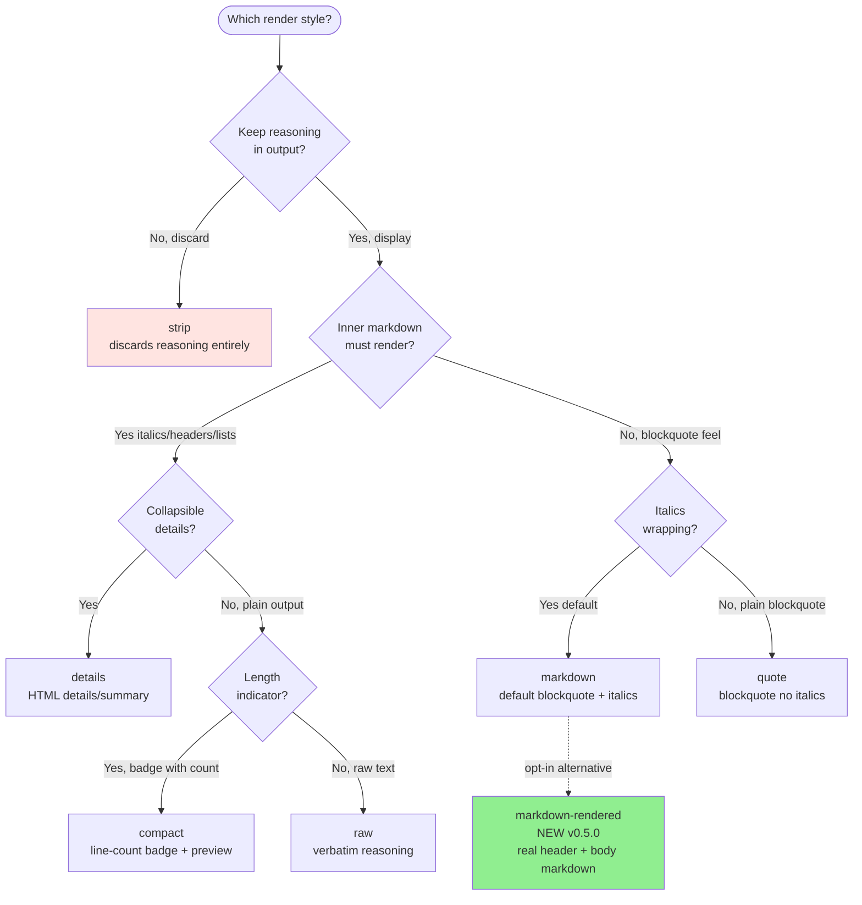
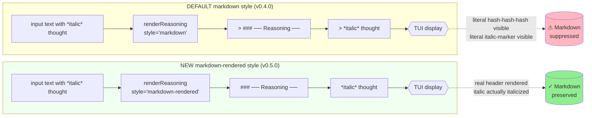
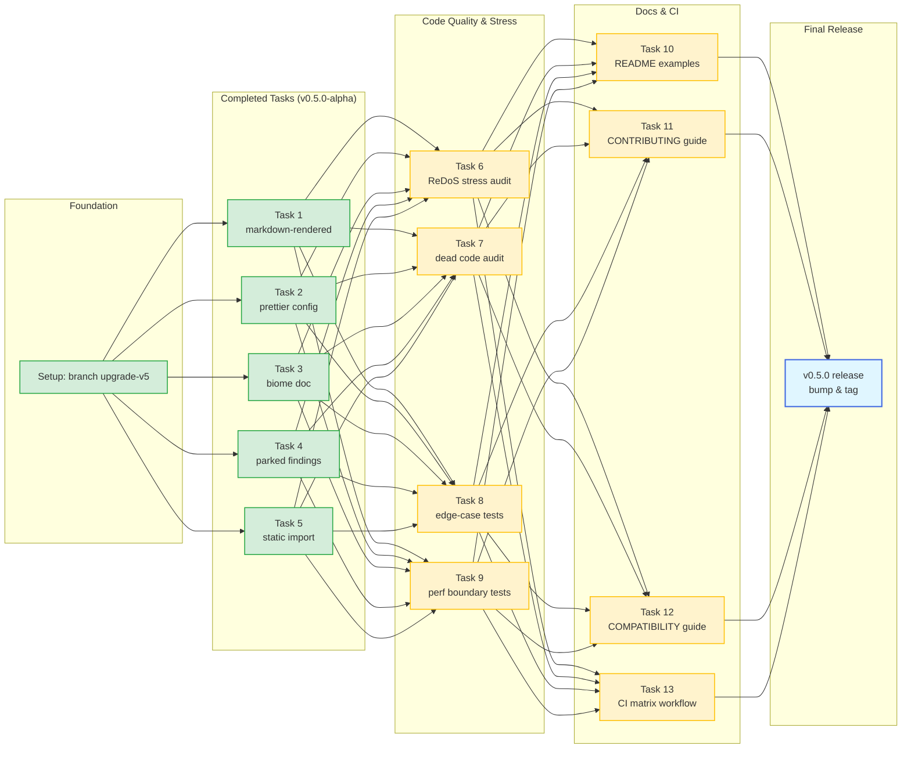

# Implementation Plan — Think Separator Plugin v5 (v0.5.0)

> **For agentic workers:** Use `superpowers:executing-plans` or `superpowers:subagent-driven-development` to execute pending tasks. Tasks 1–5 are already completed in branch `upgrade-v5`. Tasks 6–13 are pending. Checkboxes (`- [ ]`) track progress.

**Goal:** Release `opencode-think-separator-plugin` v0.5.0 by finalizing the `markdown-rendered` style (opt-in full markdown preservation), executing code quality audits (ReDoS stress testing, legacy API deprecation, extensive edge-case coverage, performance boundaries), expanding developer documentation, and creating a multi-version CI matrix.

**Base Version:** `v0.4.0` (tag `v0.4.0` at `07b8336`, branch `upgrade-v5` at `c926978`)  
**Target Version:** `v0.5.0` (clean non-breaking minor release)  
**Current Test Status:** 172 tests passing (up from 161 in v0.4.0)

---

## 1. Executive Summary & Audit of Completed vs Pending Work

| Task | Theme | Scope | Status | Notes / Commit |
|---|---|---|:---:|---|
| **Task 1** | Rendering | `markdown-rendered` render style | **DONE** | Commits `83c16a9` + `c500de9` (7 new tests) |
| **Task 2** | Config Hygiene | Prettier deprecation fix (`.prettierrc` removal) | **DONE** | Commit `842640d` |
| **Task 3** | Documentation | Biome vs Prettier split documentation | **DONE** | Commit `5491711` |
| **Task 4** | Code Polish | Parked findings from v4 (JSDoc + blank fence lines) | **DONE** | Commits `ff581ae` + `7c72e5c` |
| **Task 5** | Core Gateway | Replace dynamic import with static re-export | **DONE** | Commit `56288af` |
| **Task 6** | Security / ReDoS | Stress test and audit 5 user-facing regexes | **PENDING** | 3 adversarial timing tests (<500ms) |
| **Task 7** | Dead Code | Audit `renderResponse` & `compose` (deprecate) | **PENDING** | Maintain standalone back-compat with `@deprecated` |
| **Task 8** | Robustness | 11 edge-case tests (null, prototype-pollution, etc.) | **PENDING** | Defensive checks in config, parser & compaction |
| **Task 9** | Performance | 1MB payload boundary tests (<500ms) | **PENDING** | Test parser & renderer at scale |
| **Task 10** | Documentation | Ready-to-use configs in `examples/` & README update | **PENDING** | 5 JSON snippets for all config scenarios |
| **Task 11** | Documentation | Update `CONTRIBUTING.md` (remove stale links, check:fix) | **PENDING** | Align with modern gate workflow |
| **Task 12** | Documentation | Document OpenCode version verification methodology | **PENDING** | Document manual & CI verification in `COMPATIBILITY.md` |
| **Task 13** | CI/CD | GitHub Actions CI matrix + smoke test | **PENDING** | Test across Node & OpenCode versions without publish |
| **Release** | Delivery | Bump `package.json` to 0.5.0, update types & tag | **PENDING** | Final verification gate with `npm run check:fix` |

---

## 2. Architecture & Design Diagrams

### Diagram 1: Render Style Decision Tree (`upgrade/v5/diagram-v5-1.mmd`)



### Diagram 2: Markdown vs Markdown-Rendered Pipeline (`upgrade/v5/diagram-v5-2.mmd`)



### Diagram 3: v5 Task Roadmap & Dependency Flow (`upgrade/v5/diagram-v5-3.mmd`)



---

## 3. Detailed Tasks

### Phase 1: Completed Tasks (Summary & Audit Verification)

- [x] **Task 1: Reasoning blockquote renders inner markdown (`markdown-rendered` style)**
  - Implemented `renderMarkdownRendered` in `src/render.js:338-348`.
  - Added `"markdown-rendered"` to `RENDER_STYLES` and `ALLOWED_STYLES` in `src/config.js:84`.
  - Added TypeScript declarations in `types/index.d.ts:24-28`.
  - Verified with 7 tests in `test/render.test.js` and `test/pipeline-integration.test.js`.

- [x] **Task 2: Fix prettier config (deprecated key & duplicate file)**
  - Removed deprecated `jsxBracketSameLine: true` in `prettier.config.js`.
  - Removed redundant `.prettierrc`.
  - Verified `npm run format:check` executes with 0 warnings.

- [x] **Task 3: Document Biome vs Prettier split**
  - Added documentation paragraph in `README.md` explaining why Biome has formatter disabled in favour of Prettier.

- [x] **Task 4: Apply parked findings from v4**
  - Updated JSDoc in `src/render.js` to match actual trimming behavior.
  - Normalized inside-fence blank line formatting from `> ` to bare `>`.
  - Added regression test in `test/render.test.js:358-364`.

- [x] **Task 5: Replace dynamic import in `src/core.js` with static import**
  - Converted `await import("./stream.js")` to static top-level import.
  - Eliminated lazy loader caching boilerplate in `src/core.js`.

---

### Phase 2: Quality, Stress & Boundary Testing (Pending Tasks)

#### Task 6: Audit Regex for ReDoS Vulnerabilities
**Files:**
- Test: `test/detect-reasoning.test.js`
- Modify: `src/detect-reasoning.js` (if any pathological input exceeds threshold)

- [ ] **Step 1: Write ReDoS stress tests with timing assertions**
  In `test/detect-reasoning.test.js`, add a dedicated test suite with 3 adversarial patterns:
  1. 10,000 unclosed `<think>` tags (`"<think>".repeat(10000)`).
  2. 10,000 characters of unclosed code fence delimiters (`"```".repeat(3000)`).
  3. 200KB text with pathological `<` characters interspersed without tags.
  Assert execution completes in `< 500ms` for each.
- [ ] **Step 2: Run test suite**
  Run: `node --test test/detect-reasoning.test.js`
- [ ] **Step 3: Apply regex hardening if any test fails timing**
  Ensure non-backtracking anchors or length guards if required.
- [ ] **Step 4: Commit**
  `git commit -m "test(security): add ReDoS stress tests for parser regexes"`

---

#### Task 7: Audit Dead Code (`renderResponse` & `compose`)
**Files:**
- Modify: `src/render.js`
- Modify: `src/core.js`
- Modify: `docs/ARCHITECTURE.md`
- Modify: `types/index.d.ts`

- [ ] **Step 1: Check existing callers**
  `grep -rn "renderResponse\|compose" src/ test/ types/`
  Both functions are consumed by standalone API users (documented in `STANDALONE_USAGE.md`).
- [ ] **Step 2: Add `@deprecated` annotations instead of breaking deletion**
  Mark `renderResponse` and `compose` with `@deprecated` JSDoc in `src/render.js`, `src/core.js`, and `types/index.d.ts`.
  Clarify that OpenCode transform pipelines use in-memory message parts, while `renderResponse` is preserved for backward-compatible standalone text pipelines.
- [ ] **Step 3: Run full checks**
  Run: `npm run check:types && npm test`
- [ ] **Step 4: Commit**
  `git commit -m "refactor(render): add deprecation annotations to standalone compose and renderResponse"`

---

#### Task 8: Robust Edge-Case Test Suite
**Files:**
- Modify: `test/detect-reasoning.test.js`
- Modify: `test/config.test.js`
- Modify: `test/model-config.test.js`
- Modify: `test/compaction.test.js`
- Modify: `test/plugin.test.js`

- [ ] **Step 1: Write edge-case tests across all modules**
  1. `detect-reasoning`: `extractReasoningFromText("")`, `extractReasoningFromText(null)`, `extractReasoningFromText("text", null)`, `tags` with non-string elements.
  2. `config`: `mergeConfig({compaction: null})`, `mergeConfig({compaction: "invalid"})`, `mergeConfig({models: []})`, prototype pollution checks (`__proto__`).
  3. `model-config`: `resolveModelConfig(null, "")`, `resolveModelConfig(null, 123)`.
  4. `compaction`: `stripReasoningBlock` on malformed block (missing separator), `stripHistoryReasoning` with `maxTurns <= 0`.
  5. `plugin`: `ThinkSeparator(null, null)` factory defensive call.
- [ ] **Step 2: Run test suite**
  Run: `npm test`
- [ ] **Step 3: Fix any uncovered defensive branches**
  Verify all 11 edge cases pass cleanly.
- [ ] **Step 4: Commit**
  `git commit -m "test(robustness): add comprehensive edge-case test suite across config, detector, and compaction"`

---

#### Task 9: Performance Boundaries at Scale (1MB Payloads)
**Files:**
- Modify: `test/detect-reasoning.test.js`
- Modify: `test/render.test.js`

- [ ] **Step 1: Write 1MB stress tests**
  1. Test `extractReasoningFromText` on a 1MB payload containing mixed code blocks and `<think>` reasoning (assert `< 500ms`).
  2. Test `renderReasoning` on a 1MB reasoning text with all styles (assert `< 500ms`).
- [ ] **Step 2: Run tests**
  Run: `npm test`
- [ ] **Step 3: Commit**
  `git commit -m "test(perf): add 1MB payload boundary performance tests for detector and renderer"`

---

### Phase 3: Documentation & CI/CD Matrix

#### Task 10: Expanded Config Examples in `examples/` & README
**Files:**
- Create: `examples/opencode.compact.json`
- Create: `examples/opencode.quote.json`
- Create: `examples/opencode.markdown-rendered.json`
- Create: `examples/opencode.context-window.json`
- Create: `examples/opencode.per-model.json`
- Modify: `README.md`

- [ ] **Step 1: Create standalone example JSON configs in `examples/`**
  Provide copy-pasteable snippets for all 7 render styles and context compaction configurations.
- [ ] **Step 2: Update README with style comparison table and example links**
  Add a clear table comparing `markdown`, `markdown-rendered`, `quote`, `compact`, `details`, `raw`, `strip`.
- [ ] **Step 3: Commit**
  `git commit -m "docs(examples): add dedicated configuration snippets and style comparison matrix"`

---

#### Task 11: Update `CONTRIBUTING.md`
**Files:**
- Modify: `CONTRIBUTING.md`

- [ ] **Step 1: Remove stale plan references**
  Update line 5 to point to active docs instead of archived plans.
- [ ] **Step 2: Add modern quality gate instructions**
  Document the unified gate command `npm run check:fix` (Prettier + Biome + TypeScript + Tests).
- [ ] **Step 3: Commit**
  `git commit -m "docs(contributing): update workflow instructions and reference unified check:fix gate"`

---

#### Task 12: Document OpenCode Version Verification Methodology
**Files:**
- Modify: `docs/COMPATIBILITY.md`

- [ ] **Step 1: Document manual smoke verification steps**
  Provide clear instructions on how the plugin is linked and verified in live OpenCode sessions.
- [ ] **Step 2: Document CI automated matrix guarantees**
  Document compatibility across OpenCode versions and Node 18, 20, 22.
- [ ] **Step 3: Commit**
  `git commit -m "docs(compatibility): document manual and automated verification methodology"`

---

#### Task 13: CI Matrix for Cross-Version Testing
**Files:**
- Create: `.github/workflows/ci.yml`
- Create: `test/smoke.test.js`
- Create: `test/fixtures/smoke-message.json`

- [ ] **Step 1: Create synthetic smoke test and fixture**
  Create `test/fixtures/smoke-message.json` and `test/smoke.test.js` that tests the end-to-end plugin initialization and message transformation via the OpenCode plugin export contract without requiring a live TUI.
- [ ] **Step 2: Create `.github/workflows/ci.yml`**
  Configure matrix testing:
  - Node.js versions: `18.x`, `20.x`, `22.x`
  - Runs: `npm run format:check`, `npm run lint`, `npm run check:types`, `npm test`
- [ ] **Step 3: Commit**
  `git commit -m "ci(github): add multi-version CI workflow and standalone plugin smoke test"`

---

### Phase 4: Final Verification & Release v0.5.0

- [ ] **Step 1: Version bump in `package.json`**
  Bump version from `0.4.0` to `0.5.0`.
- [ ] **Step 2: Run full quality gate**
  Run: `npm run check:fix`
  Ensure:
  - Prettier: 100% formatted with 0 deprecations
  - Biome: 100% lint pass (0 errors)
  - TypeScript: `tsc --noEmit` exits with code 0
  - Tests: All tests pass (>185 tests)
- [ ] **Step 3: Release commit & git tag**
  ```bash
  git commit -am "chore(release): 0.5.0"
  git tag v0.5.0
  ```
