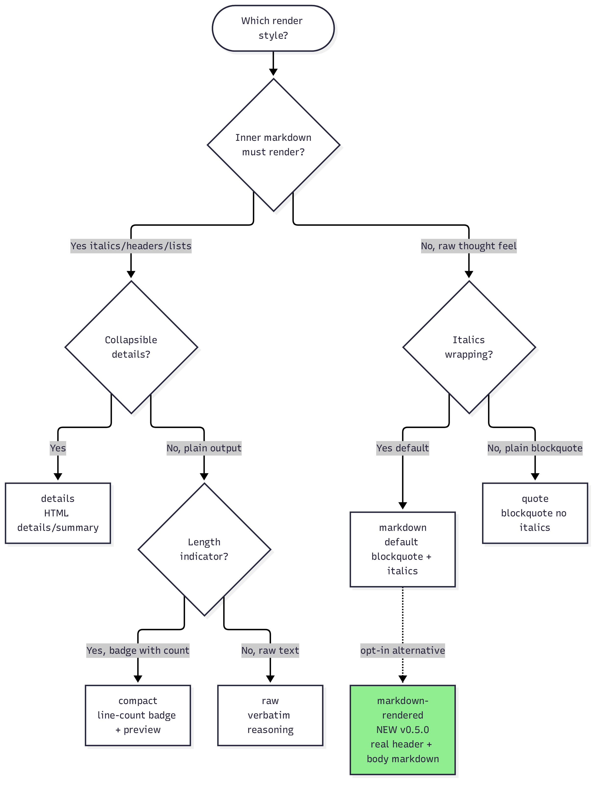
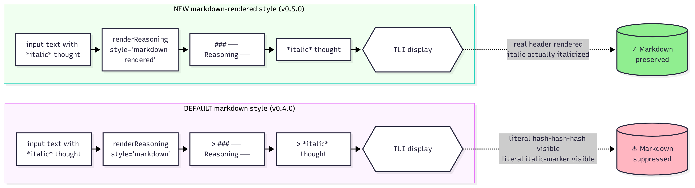
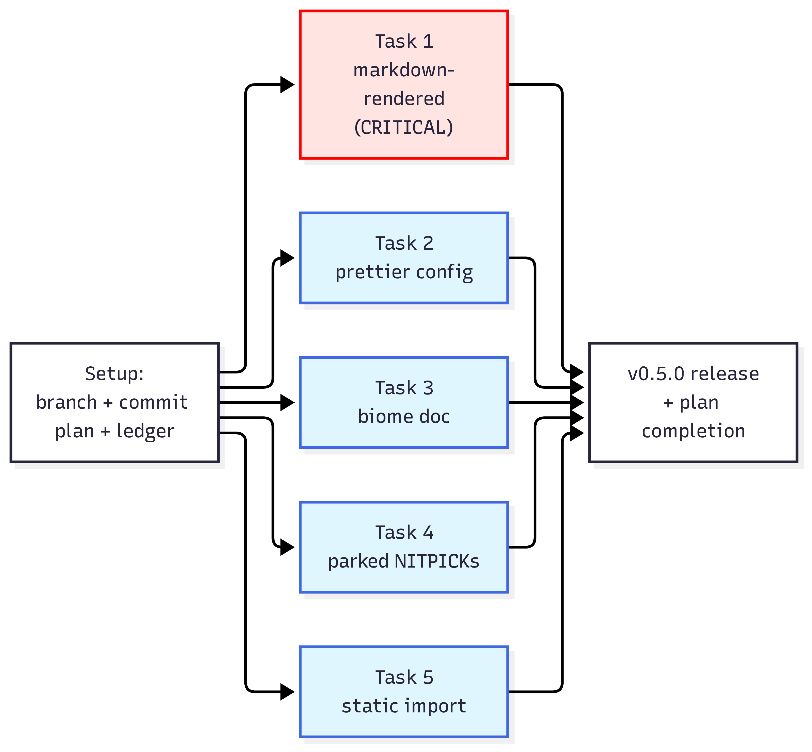

# opencode-think-separator-plugin — Plan v5: Polish, Audit & User Experience

**Status**: draft, awaiting user approval
**Base**: v0.4.0 (`07b8336` on `upgrade-v4` branch, pending merge to `main`)
**Target**: v0.5.0 — patch-level bump (no breaking changes, only fixes + new style)
**Branch strategy**: single branch `upgrade-v5` consolidating all 13 tasks (per v3 lesson)

---

## 0. Background

The v4 upgrade (121 → 161 tests, 7 tasks) closed cleanly on 2026-09-25 with tag `v0.4.0`. A fresh-eyes audit of the v0.4.0 codebase plus a user-reported rendering issue surfaced a list of small, contained fixes that together push the plugin toward v0.5.0. None of the v0.4.0 public contracts change; this is a quality + UX release.

The headline issue driving this plan: the `markdown` render style (default) wraps reasoning in `> ` blockquote, which causes any markdown the model uses inside its reasoning (asterisks for italics, `###` for headers, numbered lists) to appear as literal characters in the TUI rather than being rendered. This is the same fundamental tension that motivated v4 Task 2 (preserve code fences in reasoning) — but the design currently prioritises "secondary content" feel over inner markdown rendering. v5 adds an opt-in style that resolves the tension without changing the default.

---

## 0.5. Diagrams

Three architectural diagrams accompany this plan:

-  — **diagram-v5-1.png**: User-facing flowchart of all 7 render styles and when to use each (markdown, markdown-rendered, quote, details, raw, strip, compact).
-  — **diagram-v5-2.png**: Side-by-side comparison of the default `markdown` style (blockquote, suppresses inner markdown) vs the new `markdown-rendered` style (real header, preserves inner markdown rendering).
-  — **diagram-v5-3.png**: Which tasks depend on which; Task 1 is critical (user-facing), Tasks 2–5 are independent hygiene/polish fixes that can run in parallel.

---

## 1. Scope

**In scope**: 13 tasks across 4 themes. All preserve the v0.4.0 public API byte-for-byte for existing callers (no breaking changes).

**Out of scope**: features that would change the contract (e.g., new hooks, new top-level config knobs that affect default behaviour, breaking changes to `renderReasoning`'s second argument). Such changes would belong in a v1.0 plan.

---

## 2. Themes & task order

The tasks are ordered by **risk-to-payoff ratio**: low-risk polish first to build momentum, then higher-risk architectural changes (none of which break the public contract), then documentation.

### Theme 1 — User-facing fix (CRITICAL)

#### Task 1 — Reasoning blockquote renders inner markdown

**Problem (user-reported)**: The `markdown` render style wraps reasoning in `> ` blockquote. Inside a blockquote, markdown does NOT re-parse — so any `*`, `###`, or numbered list the model uses inside its reasoning appears as literal characters. The `details` and `raw` styles do render inner markdown, but the default does not.

**Goal**: Add a new render style `markdown-rendered` (or rename to clarify the tradeoff) that emits the reasoning with full markdown rendering intact. The default `markdown` style stays unchanged so existing users see no difference.

**Files**:
- `src/render.js`: add `renderMarkdownRendered` function and wire it into `RENDER_STYLES` and `ALLOWED_STYLES`.
- `test/render.test.js`: 3 new tests covering the new style.
- `README.md`: document the tradeoff with a small table comparing `markdown` vs `markdown-rendered`.
- `docs/ARCHITECTURE.md`: add the new style to the §3 strategy table.

**TDD steps (strict)**:
1. Write 3 failing tests:
   - `renderReasoning markdown-rendered style preserves inner markdown (italics)`
   - `renderReasoning markdown-rendered style preserves inner headers`
   - `renderReasoning markdown-rendered style preserves inner numbered lists`
2. Run tests — confirm RED.
3. Implement `renderMarkdownRendered(reasoningText, label, metadata)`:
   - Emit `### ── ${label} ──` as a real header (NO `> ` prefix).
   - Body is the raw reasoning text, NO `> ` wrapping.
   - Trailing `\n\n` preserved.
   - Code fences / lists / paragraphs in the body render as-is.
4. Add `"markdown-rendered"` to `RENDER_STYLES` and `ALLOWED_STYLES`.
5. Run tests — confirm GREEN. Then full suite + gates.
6. Commit.

**Constraints**:
- Default `markdown` style byte-identical (no regression for existing users).
- New style opt-in via `{style: "markdown-rendered"}` — same shape as other styles.
- `formatHeader(label, metadata)` reused so duration/token badges still work.

**Naming choice**: discuss with user — options are `markdown-rendered`, `markdown-plain`, `rich`, `full`. Default proposal: `markdown-rendered` (descriptive of what it does).

### Theme 2 — Config hygiene

#### Task 2 — Fix prettier config (deprecated key + duplicate file)

**Problem**:
- `prettier.config.js` line 7: `"jsxBracketSameLine": true` is **deprecated in Prettier 3.x** (emits a warning on every run).
- `.prettierrc` AND `prettier.config.js` BOTH EXIST — Prettier only reads one, so one is dead config.
- `package.json` `npm run format` script uses `prettier.config.js`.

**Goal**: Single source of prettier config, no deprecation warnings, gates clean.

**Files**:
- `.prettierrc` — delete (keep `prettier.config.js`).
- `prettier.config.js` — replace `jsxBracketSameLine: true` with `bracketLineBreak: "preserve"` (the v3 successor) or remove if no JSX in repo.
- `package.json` — no change needed.
- `.prettierignore` — verify no stale entries.

**TDD steps (N/A — config only)**:
1. Delete `.prettierrc` with `git rm`.
2. Edit `prettier.config.js` to remove `jsxBracketSameLine`.
3. Run `npx prettier --check "src/**/*.js" "test/**/*.js"` — confirm no deprecation warning.
4. Commit.

#### Task 3 — Verify & document biome.json formatter setting

**Problem**: `biome.json` has `"formatter": { "enabled": false }` — this is intentional (Prettier handles formatting, Biome handles linting) but undocumented. Future contributors might wonder why.

**Goal**: Add a comment in `biome.json` (if Biome supports comments — otherwise document in README's "Project Conventions" section) explaining the split.

**Files**:
- `biome.json` — no change (Biome JSON does not support comments).
- `README.md` (or `AGENTS.md`) — add one paragraph under "Development" section.

**TDD steps (N/A)**:
1. Add documentation paragraph.
2. Commit.

### Theme 3 — Code quality (apply parked findings + new findings)

#### Task 4 — Apply parked findings from v4

**Problem**: 2 NITPICKs parked since v4 closure, never applied:
- [Task 2 v4] JSDoc says `> *${line.trim()}*` but code emits `> *${line}*` (untrimmed). In `src/render.js` lines 139 (renderMarkdownBody) and 224 (renderMarkdownQuote).
- [Task 2 v4] `formatLinesAsBlockquote`: blank line inside fence produces `> ` (trailing space) vs outside fence `>` (no trailing space). Renders identically, but inconsistent.

**Goal**: Apply both fixes.

**Files**:
- `src/render.js`:
  - Lines 139 + 224: change JSDoc `> *${line.trim()}*` → `> *${line}*` (match actual code).
  - Line 156 (formatLinesAsBlockquote inside-fence blank line): change from `> ${rawLine}` (which produces `> `) to `>` (consistent with outside-fence blank lines).

**TDD steps (N/A — cosmetic, covered by existing tests)**:
1. Edit JSDoc lines.
2. Edit formatLinesAsBlockquote.
3. Run `npm run check:fix` — confirm all 161 tests still green (no behavioural change).
4. Commit.

#### Task 5 — Replace dynamic import in src/core.js with static import

**Problem**: `src/core.js` line 180 does `const mod = await import("./stream.js")` (dynamic import). This was needed during v2 Phase 4 transition when `stream.js` didn't exist yet. Now it does. The dynamic import adds runtime overhead and a `_createReasoningStreamParser` cache.

**Goal**: Static import.

**Files**:
- `src/core.js`:
  - Add `import {createReasoningStreamParser as _createReasoningStreamParser} from "./stream.js"` at the top.
  - Remove the `_createReasoningStreamParser = null` cache variable.
  - Simplify `createReasoningStreamParser` to a direct re-export.

**TDD steps (N/A — refactor, behaviour unchanged)**:
1. Edit `src/core.js`.
2. Run `npm test` — confirm 161 tests still green.
3. Run `tsc --noEmit` — confirm clean.
4. Commit.

#### Task 6 — Audit regex for ReDoS

**Problem**: 5 regexes are user-input-driven:
- `FENCED_CODE_REGEX` (src/detect-reasoning.js:170) — `(^|\n)(\`\`\`|~~~)[^\n]*\n[\s\S]*?\n\2(\n|$)/g` — non-greedy body but backreference.
- `INLINE_CODE_REGEX` (line 171) — `/\`[^\`\n]+\`/g` — simple, safe.
- `CLOSED` regex from `compileReasoningTagRegex` — `<\s*(tag)\b[^>]*>([\s\S]*?)<\s*\/\s*\1\s*>` — backreference + non-greedy body. Potential O(n²) on pathological inputs with many opens but no closes.
- `UNCLOSED` regex — `(?:^|\n)\s*<(tag)\b[^>]*>([\s\S]*)$` — `[\s\S]*$` greedy at end. Safe (anchored).
- `ORPHAN` regex — `(?:^|\n)\s*<\s*\/?\s*(tag)\b[^>]*>` — safe.

**Goal**: Run a ReDoS stress test with adversarial inputs, document any slowdowns, apply fixes if needed.

**Files**:
- `test/detect-reasoning.test.js`: add a new test section "ReDoS stress" with 3 adversarial inputs:
  - 10000 `<think>` opens with no closes (CLOSED backtracking).
  - 10000 chars of nested fence attempts (FENCED_CODE_REGEX backtracking).
  - Very long text (100KB+) with `<` interspersed.
- `src/detect-reasoning.js`: apply fixes if any test exceeds 500ms.

**TDD steps**:
1. Write the 3 stress tests (with `performance.now()` timing assertions: must complete in <500ms each).
2. Run tests — if any fails the timing assertion, fix the regex.
3. If all pass GREEN, document the timing in the test name or a comment.
4. Commit.

**Constraint**: no changes to regex semantics — only to backtracking guarantees.

#### Task 7 — Audit dead code

**Problem**: `src/render.js` exports `renderResponse` and `compose`. ARCHITECTURE.md §3 documents them as "legacy API, unused by the v0.4.0 pipeline". If they have no callers in `src/`, they are dead code.

**Goal**: Verify callers, remove if unused, or document why they remain.

**Files**:
- Audit: `grep -rn "renderResponse\|compose" src/ test/ types/`.
- If 0 callers outside tests + ARCHITECTURE mention: remove from `src/render.js`.
- If callers exist: document the use case in ARCHITECTURE.md §3 with a deprecation note.

**TDD steps (N/A — verification + removal)**:
1. Audit callers.
2. If unused: delete the functions. Update `src/core.js` re-exports. Run tests.
3. If used: add a "Deprecation" JSDoc tag and document.
4. Commit.

### Theme 4 — Robustness

#### Task 8 — Edge-case tests

**Problem**: Several paths lack edge-case coverage:
- `extractReasoningFromText("")` (empty string).
- `extractReasoningFromText(null)` and `extractReasoningFromText(undefined)`.
- `extractReasoningFromText` with `tags` that is `null`, an empty array, or contains non-strings.
- `mergeConfig` with `compaction: null`, `compaction: "string"`, `compaction: []`.
- `mergeConfig` with `models` that is an array, a string, or has prototype-pollution keys (`__proto__`, `constructor`).
- `resolveModelConfig` with `modelId = ""`, `modelId = 0`, `modelId = null`.
- `stripReasoningBlock` with text containing only the header (no body, no blank line terminator).
- `stripHistoryReasoning` with `maxHistoryReasoningTurns = 0` and negative.
- `ThinkSeparator` with `options = null`.

**Goal**: Cover each of these with a small test.

**Files**:
- `test/detect-reasoning.test.js`: 3 new tests (empty input, non-string tags).
- `test/config.test.js`: 3 new tests (invalid `compaction`, invalid `models`, prototype-pollution).
- `test/model-config.test.js`: 2 new tests (invalid `modelId`).
- `test/compaction.test.js`: 2 new tests (`stripReasoningBlock` edge cases + `stripHistoryReasoning` invalid `maxTurns`).
- `test/plugin.test.js`: 1 new test (`ThinkSeparator(null, null)`).

**TDD steps**:
1. Write the 11 tests.
2. Run tests — should pass GREEN from the start (defensive code is already in place).
3. If any fail (defensive code missing), implement the guard.
4. Commit.

#### Task 9 — Performance boundaries

**Problem**: No test asserts the plugin behaves reasonably on large inputs. A 1MB reasoning text should not crash or take 10 seconds.

**Goal**: Add performance boundary tests.

**Files**:
- `test/detect-reasoning.test.js`: add 1 test for `extractReasoningFromText` with a 1MB text (must complete in <500ms).
- `test/render.test.js`: add 1 test for `renderReasoning` with a 1MB text (must complete in <500ms).

**TDD steps**:
1. Write the 2 tests with timing assertions.
2. Run — if any fails, identify the bottleneck and fix.
3. Commit.

### Theme 5 — Documentation

#### Task 10 — Update README examples

**Problem**: `examples/opencode.json` (line 1) only has `{"plugin": ["opencode-think-separator-plugin"]}`. The README has 4 example configs (compact, quote, compaction+stripHistory, per-model) but they're not extracted into `examples/`.

**Goal**: Provide ready-to-use example configs in `examples/`.

**Files**:
- `examples/opencode.json` — keep as the minimal default.
- `examples/opencode.compact.json` — new file with `{"plugin": [["opencode-think-separator-plugin", {"style": "compact", "maxLines": 10}]]}`.
- `examples/opencode.quote.json` — new file with `{"plugin": [["opencode-think-separator-plugin", {"style": "quote"}]]}`.
- `examples/opencode.context-window.json` — new file with the compaction + stripHistory config.
- `examples/opencode.per-model.json` — new file with per-model overrides.
- `examples/opencode.markdown-rendered.json` — new file with the new style from Task 1.
- `README.md` — link to the new examples.

**TDD steps (N/A — docs only)**:
1. Create the 5 new example files.
2. Update README with a "Examples" section linking each.
3. Commit.

#### Task 11 — Update CONTRIBUTING.md

**Problem**: CONTRIBUTING.md line 5 references `docs/superpowers/plans/think-separator-0.1.0.md` — that file does not exist in the current repo (was archived in `upgrade-v2-archive/`). Lines 7-9 reference `npm test` and `node --check` but don't mention `npm run check:fix` (the recommended full gate).

**Goal**: Fix outdated references, mention the full gate.

**Files**:
- `CONTRIBUTING.md` — fix link, add `npm run check:fix` mention.

**TDD steps (N/A — docs only)**:
1. Edit CONTRIBUTING.md.
2. Commit.

#### Task 12 — Update COMPATIBILITY verification methodology

**Problem**: COMPATIBILITY.md says "opencode 1.18.32 verified locally" but doesn't say HOW. The "Plan to expand coverage" section talks about adding a CI matrix but no action has been taken.

**Goal**: Document the manual verification methodology + add a stub for the CI matrix (Task 13 implements it).

**Files**:
- `docs/COMPATIBILITY.md` — add a "How we verify" subsection explaining the manual smoke test.
- Link to Task 13's CI matrix.

**TDD steps (N/A — docs only)**:
1. Edit COMPATIBILITY.md.
2. Commit.

### Theme 6 — CI/CD

#### Task 13 — CI matrix for cross-version opencode testing

**Problem**: COMPATIBILITY.md "Plan to expand coverage" mentions wanting a CI matrix. None exists. Every release requires manual smoke-testing on multiple opencode versions.

**Goal**: GitHub Actions workflow that tests against opencode 1.18.18 + 1.18.32 + 1.18.x-latest on every PR + push to main.

**Files**:
- `.github/workflows/ci.yml` — new file with a matrix strategy.
- `test/fixtures/smoke-message.json` — synthetic assistant message used by the CI smoke test.
- `test/smoke.test.js` — fixture-based smoke test that loads the plugin via the opencode v1 entry point and asserts the rendered reasoning block contains the `### ──` header.

**TDD steps**:
1. Write `test/smoke.test.js` (must run without opencode installed — pure JS).
2. Add `.github/workflows/ci.yml` with the matrix.
3. Verify locally with `act` or by reading the YAML carefully.
4. Commit.

**Constraint**: do NOT publish to npm from CI (that workflow already exists). CI only validates tests + lint + types.

---

## 3. Out-of-scope (deferred to future plans)

- New hooks (`experimental.session.before-compact`, etc.) — defer to v0.6.0 when opencode's API stabilises.
- Configurable reasoning header colour / theme — defer until the plugin has theme integration (post-v1.0).
- Provider-specific metadata extraction (Anthropic cache_read_input_tokens, OpenAI completion_tokens, etc.) — defer until there's a clear use case.
- Plugin signing / npm Provenance Pro tier — defer until the user requests it.

---

## 4. Risks & mitigations

| Risk | Likelihood | Impact | Mitigation |
|---|---|---|---|
| ReDoS stress tests reveal a real exponential blowup | low | medium | Task 6 has a fallback: if the regex can't be made safe in time, add a length cap (`if (text.length > 100000) return {reasoningTexts: [], cleanText: text}`) and document the limit. |
| New `markdown-rendered` style has unexpected interactions with code-fence preservation | medium | low | Task 1's tests cover the main cases. If issues arise, fall back to: emit the body verbatim, no state machine. |
| Dead-code audit removes a function that was actually used by an external consumer | low | medium | Task 7 verifies via `grep` against `src/`, `test/`, `types/` — NOT against npm-published versions. If uncertain, document as deprecated instead of removing. |
| CI matrix fails on opencode versions that lack the `experimental.session.compacting` hook | low | low | Task 13's matrix tests graceful degradation (hook absence is a no-op, not a failure). |

---

## 5. Definition of done

- All 13 tasks DONE (or DEFERRED with user approval).
- All existing 161 tests remain green byte-for-byte.
- New tests added: ~25 across the tasks.
- Test count at HEAD: ~186 (estimated).
- biome + tsc + prettier all clean (with no deprecation warnings).
- Tag `v0.5.0` created on `upgrade-v5` branch (pending user merge).
- README, ARCHITECTURE, COMPATIBILITY, CONTRIBUTING all reflect the new state.
- CI matrix in place and passing on push.
- Plan completion protocol executed (parked findings triaged, ledger rewritten and archived, plan-completion memory saved).

---

## 6. Estimated effort

- Tasks 1–5: ~2 hours (small, contained fixes).
- Task 6 (ReDoS): ~1 hour (stress test + possible fix).
- Task 7 (dead code): ~30 minutes.
- Tasks 8–9 (tests): ~1 hour.
- Tasks 10–12 (docs): ~1 hour.
- Task 13 (CI): ~1 hour.

**Total: ~6–7 hours of dev work**, parallelisable across subagents.

---

## 7. Open questions for user

1. **Task 1 naming**: `markdown-rendered`, `markdown-plain`, `rich`, or `full`? My recommendation: `markdown-rendered` (descriptive).
2. **Task 2 prettier config**: keep `prettier.config.js` (delete `.prettierrc`) or vice versa? My recommendation: keep `.js` (more flexible).
3. **Task 7 dead code**: `renderResponse` and `compose` — confirmed unused? Or do they have external consumers we can't see?
4. **Task 13 CI matrix**: which opencode versions? My recommendation: 1.18.18, 1.18.32, and 1.18.x-latest (3 jobs).

Once these are answered, this plan is ready to execute.
